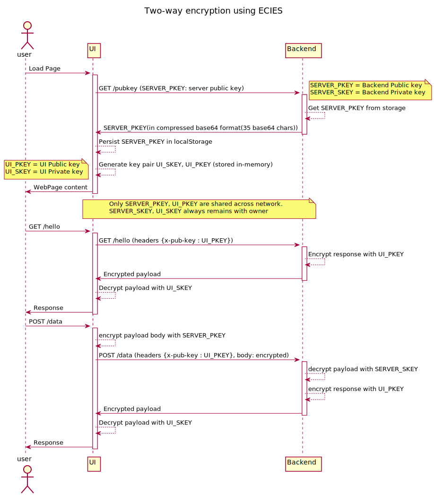

# Introduction
ECC based Encryption/Decryption in JS/wasm and python based app.
`[ecc, wasm, js, python, rust]`

This is a demo project on encrypted communication between UI & backend over http/s, and delegating all heavy lifting(encryption in this case) to wasm binary compiled from `ecies` rust crate(https://docs.rs/ecies/0.2.1/ecies). The js binding for `ecies` wasm binary is handled with `ecies-wasm` npm package.

UI is built with reactjs and backend is a flask based api server. Encryption scheme being used: `ecies`(ECC based hybrid encryption).


## How to start:
- Run server:
  - Generate privyte key with `python eciespy_demo.py`, save content as `flask-app/keys/private.ec.key`
    ```sh
    cd flask-app
    python3 -m venv venv
    source venv/bin/activate
    pip install -r requirements.txt
    python app.py
    ```
- Run UI:
  - Update server host url in `api.js`
    ```sh
    cd ui-react-webapck
    yarn
    yarn start
    ```

## Workflow:
- Server app hosts private-key in `flask-app/keys` folder (default name `private.ec.key`), 
- It generate public key on the go, and serve it at `/pubkey`
- UI calls `/pubkey` to get a public key(ECC based compressed public key in base64 format)
- For further calls UI encrypts the payload with the public key
- On server private key is used to decrypt the payload.
## Demo example:
- UI gets public key `GET /pubkey`, save to Local Storage
- Get `age`, `msg` as input, create JSON payload, encrypt using Public Key, convert encrypted data to base64.
- call `POST /data` with payload
- Server decrypts base64 encoded payload, decrypts using private-key, send `age`, `msg` back in response.


## Useful Commands:
- Create private key: `openssl ecparam -name prime256v1 -genkey -noout -out private.ec.key`
- Create public key: `openssl ec -in private.ec.key -pubout -out public.pem`
- Encrypt: `openssl cms -encrypt -binary -aes-256-cbc -in plaintext.dat -out ciphertext.dat p256-cert.pem`
- wasm build for web:
    ```sh
    cargo install wasm-pack
    wasm-pack build --target web
    cargo install cargo-generate
    cargo generate --git https://github.com/rustwasm/wasm-pack-template.git --name mycrypto
    ```
